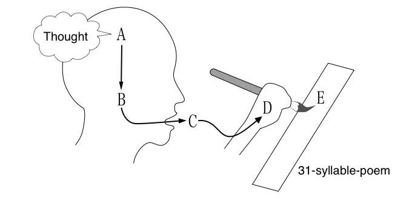
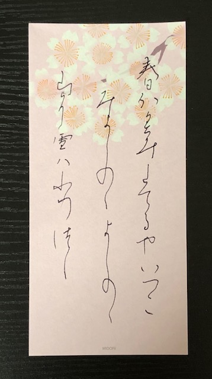

### Plotting Poetry 2025

# Transforming Poetic Thought into Waka:

### How to Pack the Skeleton into a 31-Syllable Closet

- Bor Hodošček, The University of Osaka
- Hilofumi Yamamoto, Institute of Science Tokyo

---

## **Basics of WAKA**

Classical Japanese Poetry, WAKA

- WA &rarr; Japanese / Japanese style
- KA &rarr; Song

    Spring Haze

---

### **Early Established Waka**

- The Man'yoshu: est. around 7-8th century in Chinese notation.
- The Kokinshu: est. ca. 905 in Japanese notation.

---

### **Style and Rhetorics**

<!-- JPN_ONLY_START
- Only 31 syllables with 5,7,5,7,7 sounds
- JPN:自然や感情を簡潔に表現する特徴
- 掛詞、枕詞、序詞
JPN_ONLY_END -->

- Include only 31 syllables with 5,7,5,7,7 sounds
- Express natural views and emotions in a simple sentence.
- Use of rhetorics to create a poetic atmosphere:
- Pun (kakekotoba),
- Pillow words (makurakotoba), and
- Introductory words (o-kotoba)

---

### **Preface of Kokinshū: Kanajo**

    やまとうたは、人の心を種として、よろづの言の葉とぞなれりける。
    世の中にある人、ことわざ繁きものなれば、心に思ふことを、見るもの聞くものにつけて、言ひ出せるなり。

    Japanese poetry (yamato-uta) takes the human heart as its seed, and from it
    grows a myriad of words and leaves. Since people living in this world are
    surrounded by countless events, they express what they feel in their hearts
    by attaching it to the things they see and hear.

---

### **Preface of Kokinshū: Kanajo**

- Does not mention the 31-syllable form
- The format is drived from the practice of poetic expression
- Not too short, not too long, just right for expressing emotions
- One theory suggests that the pleasantness of phonetics and rhythm (5-7 pattern),
- The length of breath, and ease of recitation and transmission are involved.

---

### **Poetic ideas change into 31-Syllable Form**

- The 31-syllable is the final form of the poem, not the initial one.
- The constraint of Waka is the construction of 5,7,5,7,7 syllables.
- Poets create a poem under the 5 segments of 5,7,5,7,7 syllables constraint.
- It is the first step to shorten ideas to fit to 5 or 7 syllables.

---

### **Poetic Rules may include:**

- Omission of grammatical elements
- Inversion of word order
- Symbolic substitution
- Nominalization
- Manipulation of ambiguity
- Compression of meaning
- Expansion of meaning
- Reinterpretation of context
  ...

---

### **Goals**

- Differences between waka and its translation
- Identify compression patterns for poetic thought
- Explore constraints and expression in 31-syllable form

---

## **Material**

- A) Kokinshu: a collection of 1000 waka poems
- B) Modern Japanese translations: 10 sets of translations

Parallel corpus of 1000 waka and 10 modern Japanese translations

---

### **Ten kinds of the Translations**

| No. | Translator                  | Year | Pages | Manuscript | Translation Style              |
| --: | :-------------------------- | ---: | ----: | :--------- | :----------------------------- |
|  1. | Kaneko Motoomi              | 1933 | 1,105 | Teika      | Literal translation            |
|  2. | Kubota Utsubo               | 1960 | 1,449 | Teika      | Literal translation            |
|  3. | Matsuda Takeo               | 1968 | 1,998 | Teika      | Free translation               |
|  4. | Ozawa Masao                 | 1971 |   544 | Teika      | Changes word order and grammar |
|  5. | Takeoka Masao               | 1976 | 2,278 | Teika      | Literal translation            |
|  6. | Okumura Tsuneya             | 1978 |   434 | Teika      | Respects author's intent       |
|  7. | Kusojin Hitaku              | 1979 | 1,260 | Teika      | Supplements words              |
|  8. | Komachiya Teruhiko          | 1982 |   407 | Teika      | Unknown                        |
|  9. | Kojima Noriyuki & Arai Eizo | 1989 |   483 | Teika      | Unknown                        |
| 10. | Katagiri Yoichi             | 1998 | 3,022 | Teika      | Literal translation            |

---

### **Steps of the Analysis**

- Step 1: Prepare Kokinshu 1000 original dataset (OP).
- Step 2: Prepare 10 kinds of translation datasets (CT).
- Step 3: Divide both OP and CT sentences into tokens.
- Step 4: Attach Meta codes based on WSLP (semantic principle codes) to each token.
- Step 5: Compare OP with CT by Meta codes.
- Step 6: Describe the predication construction patterns.
- Step 7: Describe the noun phrase construction patterns.
- Step 8: Modeling of poetic construction.

<!--
- Step 2: matching done by token codes based on WSLP (semantic principle codes)
- Step 3: Basic statistics and Residual patterns.
- Step 4: Differences between Translators / Seasonal Sections
- Step 5: Topological pattern lists
-->

---

## Computer programms

- Align waka with contemporary paraphrases
- Use phrase gloss and structured data
- Analyze rule types and transformation limits

---

## Challenges

- Literal vs. interpretive gaps
- Compression loss in reverse mapping
- Ambiguity in source expressions

---

## Toward a Model

- Create typology of transformation rules
- Visualize linguistic constraints
- Evaluate poetic fidelity and transformation cost

---

## **Methods**

- Using a parallel corpus of waka (OP) and modern Japanese translations (CT)
- Align waka (OP) with contemporary translations (CT)
- Use phrase gloss and structured data
- Analyze rule types and transformation limits
- Identify compression patterns for poetic thought

---

### **Goals**

- Obtain some typical conversion patterns between OP and CT.
  - Grammatical pattern, especially predicative elements.
    i.e. tense, aspect, &larr; elements making a poem longer.
  - Lexical construction such as proper nouns.
  - Rhetorical techniques &rarr; such as implications.

<!-- JPN_ONLY_START
1. 高頻度の変換ルールをリストアップ
- 1000首×10訳 = 1万件 の現代語訳があるため、まず高頻度の変換パターンを抽出
  例: 「～してしまった」→「～にけり」が頻繁に出現するか？
- 形態素解析を用いて、文法変化のパターン を統計的に分析

2. 変換パターンのクラスタリング

- 文法変換（助詞の変更、動詞の時制変化）
- 語彙変換（現代語 → 和歌語彙）
- 構造変換（主語の省略、語順の変更）
- 修辞技法（掛詞、縁語、比喩など）

3. 変換ルールを機械学習でモデル化できるか検討

- ルールベースの変換モデル（決定木やルールマイニング）
- 統計的手法（n-gram分析で和歌に特徴的な表現を抽出）

JPN_ONLY_END -->

---

### **Parallel Comparison between OP and CT**

Kokinshu No. 3 CT by kaneko

OP   : はるがすみ.たてる.や.いづこ.みよしの.の.よしの.の.やまに.ゆき.は.ふりつつ
Gloss: spring haze.arise.Q.where?.Miyoshino.of.Yoshino.of.Mt.snow.falling
-----------
Spring haze—where does it rise? On Mount Yoshino in Yoshino, the snow keeps falling and falling.

CT   : 春には成ったが、長閑な霞の立っているのは何処の辺か、この吉野の里の吉野山には
       雪が降り降りして、一向に春めきもしない。
Gloss: spring----------------haze.arize---------where----Q------Yoshino--MtYoshino-
       snow--fallfall-----------------------
-----------
Spring has arrived, but where is that gentle haze drifting? Here in the Yoshino village, on Mount Yoshino, snow keeps falling and falling, and it shows no sign of spring at all.

---

### **OP: Kokinshu No.3**

1 KW000003 111 1 02 00 00 BG-01-5152-09-040-A はるがすみ はるがすみ 春霞 spring haze
1 KW000003 111 3 02 00 00 BG-01-1624-02-010-A -- はる 春 spring
1 KW000003 111 3 02 00 00 BG-01-5152-09-010-A -- かすみ 霞 haze
1 KW000003 211 0 47 25 04 BG-02-1513-01-010-A たて たつ 立つ
1 KW000003 212 0 74 68 20 BG-09-0010-03-030-C る り り
1 KW000003 213 0 65 00 00 BG-08-0065-14-010-C や や や
1 KW000003 221 0 14 00 00 BG-01-1700-02-100-C いづこ いづこ 何処
1 KW000003 311 0 11 00 00 CH-29-0000-20-010-A みよしの みよしの 御吉野
1 KW000003 312 0 71 00 00 BG-08-0071-01-010-A の の の
1 KW000003 411 0 11 00 00 CH-29-0000-20-010-A よしの よしの 吉野
1 KW000003 412 0 71 00 00 BG-08-0071-01-010-A の の の
1 KW000003 421 0 02 00 00 BG-01-5240-05-010-A やま やま 山
1 KW000003 422 0 61 00 00 BG-08-0061-05-010-A に に に
1 KW000003 511 0 02 00 00 BG-01-5153-07-010-A ゆき ゆき 雪
1 KW000003 512 0 65 00 00 BG-08-0065-07-010-A は は は
1 KW000003 521 0 47 28 03 BG-02-1540-10-010-A ふり ふる 降る
2 KW000003 521 2 47 28 03 BG-02-5150-03-010-A ふり ふる 降る
1 KW000003 522 0 64 00 00 BG-08-0064-15-010-A つつ つつ つつ

---

### **CT: Kaneko No.3**

1 kaneko 0003 0 02 00 00 BG-01-1624-02-010-A 春 はる 春 spring
1 kaneko 0003 0 61 00 00 BG-08-0061-05-010-A に に に
1 kaneko 0003 0 65 00 00 BG-08-0065-07-010-A は は は
1 kaneko 0003 0 47 17 06 BG-02-1220-01-030-A 成っ なる 成る
1 kaneko 0003 0 74 54 01 BG-09-0010-04-010-A た た た
1 kaneko 0003 0 64 00 00 BG-08-0064-04-010-A が が が
1 kaneko 0003 0 79 00 00 BG-16-0079-01-010-A 、 、 、
1 kaneko 0003 1 18 00 00 BG-03-3010-02-140-A 長閑 のどか 長閑
1 kaneko 0003 2 18 00 00 BG-03-5150-02-040-A -- のどか のどか
1 kaneko 0003 0 74 55 06 BG-09-0050-01-030-A な だ だ
1 kaneko 0003 0 02 00 00 BG-01-5152-09-010-A 霞 かすみ 霞 haze
1 kaneko 0003 0 61 00 00 BG-08-0061-07-010-A の の の
1 kaneko 0003 0 47 13 05 BG-02-1513-01-010-A 立っ たつ 立つ
2 kaneko 0003 2 47 13 05 BG-02-1521-06-020-A 立っ たつ 立つ
3 kaneko 0003 2 47 13 05 BG-02-3330-11-020-A 立っ たつ 立つ
4 kaneko 0003 2 47 13 05 BG-02-3391-02-110-A 立っ たつ 立つ
1 kaneko 0003 0 64 00 00 BG-08-0064-16-010-A て て て
    ... continues

---

### **Meta-code system**

 BG-01-2030-01-030-A-かみ-神 (god)
&uarr;&uarr;&uarr;
GFE
&darr;&darr;&darr;
 BG-01-2030-01-250-A-ほとけ-仏 (Buddha)

- G: Group match... 10 digits
- F: Field match...... 13 digits
- E: Exact match..... 17 digits

The three matching levels are judged by the length of BG-code digits.

---

### **Matching Diagram**

 +-------- number of pair
 |  +----- value of exact=17, field=13, group=10
 |  |  +-- number of POS
 |  |  |
 |  |  |   number of OP token -----+     +----- number of CT token
 |  |  |             OP token --+  |     |  +-- CT token
 |  |  |                        |  |     |  |
 1 13  2                       春 01 <-> 00 春
 2 17  2                       霞 02 <-> 10 霞
 3 17 47                     立つ 03 <-> 12 立つ
 4 13 65                       や 05 <-> 26 か
 5 17 14                     何処 06 <-> 20 何処
 6 17 71                       の 08 <-> 21 の
 7 17 11                     吉野 09 <-> 30 吉野
 8 17 71                       の 10 <-> 31 の
 9 17  2                       山 11 <-> 37 山
10 17 61                       に 12 <-> 38 に
11 17  2                       雪 13 <-> 40 雪
12 17 65                       は 14 <-> 02 は
13 17 47                     降る 16 <-> 43 降る
14 10 64                     つつ 17 <-> 47 て

---

### **Elements breakdown between OP and CT**

OP(original poem; valid number of items)             = 16
E (ratio of exact agreement)                        11/16 = 0.688
F (ratio of field agreement)                         2/16 = 0.125
G (ratio of group agreement)                         1/16 = 0.062
T (ratio of total agreement)                        14/16 = 0.875
U (ratio of unmatched)                              1 - T = 0.125
    ------
CT(contemporary translation; valid number of items)  = 39
W (ratio of original word use)                      11/39 = 0.282
A (ratio of annotation)                             1 - W = 0.718
- breakdown of the annotation -
P1(ratio of FG paraphrased)                       (F+G)/V = 0.077
P2(ratio of U paraphrased)                       (A-P1)*U = 0.080
    ------
D (ratio of purely added)                        A-(P1+P2)= 0.561
H (theoretical value)                             1-16/39 = 0.590
Gap:                                             fabs(D-H)= 0.029

---

### Four Seasons Sections of Kokin Wakashū

| Section | Volume Number | Range        | Corresponding Numbers | Number of Poems |
| ------- | ------------- | ------------ | --------------------- | --------------- |
| Spring  | Volume 1      | Spring Upper | 1-55                  | 55 poems        |
| Spring  | Volume 2      | Spring Lower | 56-110                | 55 poems        |
| Summer  | Volume 3      | Summer       | 111-124               | 14 poems        |
| Autumn  | Volume 4      | Autumn Upper | 125-179               | 55 poems        |
| Autumn  | Volume 5      | Autumn Lower | 180-232               | 53 poems        |
| Winter  | Volume 6      | Winter       | 233-249               | 17 poems        |

---

## Results

- Identify and classify poetic strategies
- Analyze how poetic thought is transfigured
- Uncover underlying rules (overt and covert)
- Explore the implications of compression
- Simulate the transformation process:

---

## Discussion

- Explore poetic compression in modern Japanese
- Analyze constraints in poetic expression
- Discuss implications for translation and interpretation
- Consider cultural and linguistic factors

---

## Conclusion

- Waka as a lens for poetic thought
- Compression as a creative constraint
- Future research directions
- Implications for translation studies

---

### Predicate sections

- The simplest verb form can express variously.

---

### Content words

- No modifications.
- Noun and adjective expand images
