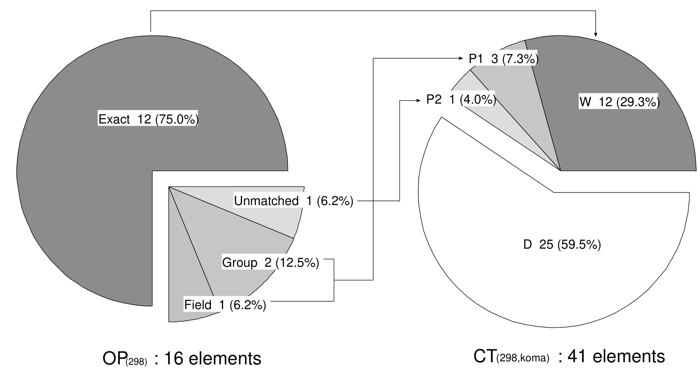
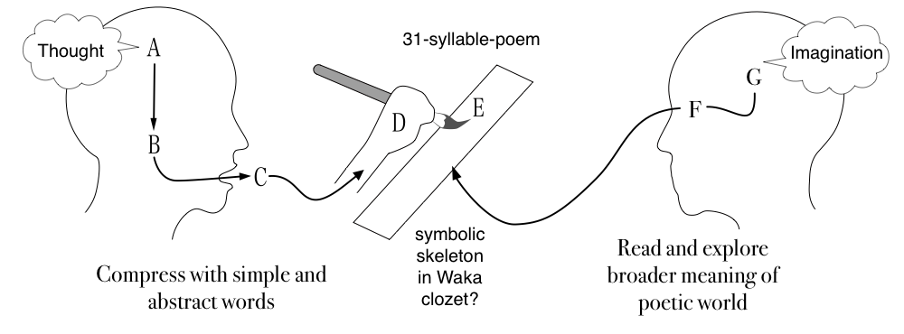

### Plotting Poetry 2025

# <span class="red">Transforming Poetic Thought into Waka:</span>

### How to Pack the Skeleton into a 31-Syllable Closet

- Bor Hodošček, <span class="blue">The University of Osaka</span>
- Hilofumi Yamamoto, <span class="blue">Institute of Science Tokyo</span>


---

## Basics of WAKA

Classical Japanese Poetry, <span class="red">WA</span><span class="blue">KA</span>

- <span class="red">WA</span> &rarr; Japanese / Japanese style
- <span class="blue">KA</span> &rarr; Song


<!-- JPN_ONLY_START


<div style="text-align: right;">
    Spring Haze


</div>
 -->

---

### **Early Established Waka**

- The Man'yoshu: est. around 7-8th century in Chinese notation.
  written in Chinese characters, but read in Japanese.
- The Kokinshu: est. ca. 905 in Japanese notation.
  written in Japanese characters, and read in Japanese.

- <span class="red">Before the Man'yoshu, Kanshi (Chinese poetry) was the dominant form. </span>

---

### **Style and Rhetorics**

<!-- JPN_ONLY_START
- Only 31 syllables with 5,7,5,7,7 sounds
- JPN:自然や感情を簡潔に表現する特徴
- 掛詞、枕詞、序詞
JPN_ONLY_END -->

- Include only 31 syllables with 5,7,5,7,7 sounds

<table class="large">
<tr><th></th><th>Japanese</th><th> Romaji</th><th>English Translation</th></tr>
<tr><td> 5</td><td> うめがえに     </td><td> ume ga e ni         </td><td> at the plum branch   </td></tr>
<tr><td> 7</td><td> きゐるうぐひす </td><td> kiiru uguhisu       </td><td> warbler came         </td></tr>
<tr><td> 5</td><td> はるかけて     </td><td> haru kakete         </td><td> cries over spring    </td></tr>
<tr><td> 7</td><td> なけどもいまだ </td><td> nake domo imada     </td><td> even though it cries </td></tr>
<tr><td> 7</td><td> ゆきはふりつつ </td><td> yuki ha furi tsutsu </td><td> snow keeps falling   </td></tr>
</table>

Theme: <span class="red">Waiting for the arrival of spring</span>

<!-- JPN_ONLY_START
梅の枝に来馴れている鴬が、冬時分からこの春へかけて頻りに鳴くけれども、未だ雪は降り降りして、一向春めかぬことよ。
-->

---

### **Style and Rhetorics**

- Express natural views and emotions in a simple sentence:

  - plum branch, warbler, spring, snow

- Use of rhetorics to create a poetic atmosphere:
  - Pun (kakekotoba)
  - Pillow words (makurakotoba)
  - Introductory words (o-kotoba)

---

### **Preface of Kokinshū: Kanajo**

<div class="dataset">
やまとうたは、人の心を種として、
<span class="red">よろづの言の葉とぞなれりける</span>。
世の中にある人、ことわざ繁きものなれば、
<span class="red">心に思ふことを、見るもの聞くものにつけて</span>、言ひ出せるなり。
</div>

<div class="dataset">
Japanese poetry (yamato-uta) takes the human heart as its seed, 
and from it grows <span class="red">a myriad of words and leaves</span>.
Since people living in this world are
surrounded by countless events,
they express what they feel in their hearts
<span class="red">by attaching it to the things they see and hear</span>.
</div>

---

### **Preface of Kokinshū: Kanajo**

- Does not mention the 31-syllable form
- The format is drived from the practice of poetic expression
- Not too short, not too long, just right for expressing emotions
- One theory suggests that the pleasantness of phonetics and rhythm (5-7 pattern),
- The length of breath, and ease of recitation and transmission are involved.

---

### **Poetic ideas pack into 31-Syllable Form**

- The 31-syllable is the final form of the poem, not the initial one.
- The constraint of Waka is the construction of 5,7,5,7,7 syllables.
- Poets create a poem under the 5 segments of 5,7,5,7,7 syllables constraint.
- It is the first step to shorten ideas to fit to 5 or 7 syllables.

---

### **Poetic Rules may include:**

- Omission of grammatical elements
- Inversion of word order
- Symbolic substitution
- Nominalization
- Manipulation of ambiguity
- Compression of meaning
- Expansion of meaning
- Reinterpretation of context
  ...

---

### **Obtain some typical conversion patterns from both**

- OP: original poems, and
- CT: contemporary translations

---

### **Through the comparison of OP and CT, we can obtain:**

- Grammatical pattern, especially predicative elements.
  i.e. tense, aspect, &larr; elements making a poem longer.
- Lexical construction such as proper nouns.
- Rhetorical techniques &rarr; such as implications.

---

## **Material**

- A) Kokinshu: a collection of 1000 waka poems
- B) Modern Japanese translations: 10 sets of translations
  &rarr; Parallel corpus: a dataset of original poems and their translations

---

### **A: Kokinshu 1000 original dataset (OP)**

- **[Hachidaishu Classical Japanese Poetic Vocabulary Dataset](https://zenodo.org/records/14001396)** on Zenodo contains the original poems of the Hachidaishu (including the Kokinshu) and their semantic codes.

- https://zenodo.org/records/14001396
- Creators: Yamamoto, Hilofumi and Hodošček, Bor
- Published: October 28, 2024 / Version v1.0.1
- Hachidaishu classical Japanese poetic vocabulary dataset
- [](https://doi.org/10.5281/zenodo.14001396)

---

### **B: Ten sets of the Translations**

| No. | Translator                  | Year | Pages | Manuscript | Translation Style              |
| --: | :-------------------------- | ---: | ----: | :--------- | :----------------------------- |
|  1. | Kaneko Motoomi\*            | 1933 | 1,105 | Teika      | Literal translation            |
|  2. | Kubota Utsubo               | 1960 | 1,449 | Teika      | Literal translation            |
|  3. | Matsuda Takeo               | 1968 | 1,998 | Teika      | Free translation               |
|  4. | Ozawa Masao                 | 1971 |   544 | Teika      | Changes word order and grammar |
|  5. | Takeoka Masao               | 1976 | 2,278 | Teika      | Literal translation            |
|  6. | Okumura Tsuneya             | 1978 |   434 | Teika      | Respects author's intent       |
|  7. | Kusojin Hitaku              | 1979 | 1,260 | Teika      | Supplements words              |
|  8. | Komachiya Teruhiko          | 1982 |   407 | Teika      | Unknown                        |
|  9. | Kojima Noriyuki & Arai Eizo | 1989 |   483 | Teika      | Unknown                        |
| 10. | Katagiri Yoichi             | 1998 | 3,022 | Teika      | Literal translation            |

---

### **Kokinwakashu Hyoshaku by Motoomi Kaneko**

- only Kaneko Motoomi's translation is available on Zenodo.
- [Kokinwakashu Hyoshaku by Motoomi Kaneko translation sentence vocabulary dataset](https://zenodo.org/records/13942707)
- https://zenodo.org/records/13942707
- Hilofumi Yamamoto, Bor Hodošček, and Xudong Chen
- Published October 16, 2024 / Version v1.0.1
- [](https://doi.org/10.5281/zenodo.13942707)

---

## **Methods**

- Using a parallel corpus of waka (OP) and modern Japanese translations (CT)
- Align waka (OP) with contemporary translations (CT)
- Using BG-code (WLSP: word list semantic principle)
  semantic principle codes to match words by 3 levels of categorical similarity.
  https://github.com/masayu-a/WLSP

<!--

### **Steps**

- Step 1: Prepare Kokinshu 1000 original dataset (OP).
- Step 2: Prepare 10 kinds of translation datasets (CT).
- Step 3: Divide both OP and CT sentences into tokens.
- Step 4: Attach Meta codes based on WSLP (semantic principle codes) to each token.
- Step 5: Compare OP with CT by Meta codes.
- Step 6: Describe the predication construction patterns.
- Step 7: Describe the noun phrase construction patterns.
- Step 8: Modeling of poetic construction.


-->

### **Subtraction**

<span class="Largefont">CT - OP = Residual</span>

- We will subtract the elements of OP from the elements of CT.
- In other words, we will find out what the CT needs to say that the OP does not say.

---

### **Parallel Comparison between OP and CT**

Kokinshu No. 3 CT by kaneko

<div class="dataset"><span class="blue">
OP   : はるがすみ.たてる.や.いづこ.みよしの.の.よしの.の.やまに.ゆき.は.ふりつつ</span>
Gloss: spring haze.arise.Q.where?.Miyoshino.of.Yoshino.of.Mt.snow.falling
-----------
Spring haze—where does it rise? On Mount Yoshino in Yoshino, the snow keeps falling and falling.

</div>

<div class="dataset"><span class="red">
CT   : 春には成ったが、長閑な霞の立っているのは何処の辺か、この吉野の里の吉野山には
       雪が降り降りして、一向に春めきもしない。</span>
Gloss: spring----------------haze.arize---------where----Q------Yoshino--MtYoshino-
       snow--fallfall-----------------------
-----------
Spring has arrived, but where is that gentle haze drifting? Here in the Yoshino village, on Mount Yoshino, snow keeps falling and falling, and it shows no sign of spring at all.
</div>

---

We anotated each poem and each translation as the following:

---

### **OP: Kokinshu No.3**

<div class="dataset">
1 KW000003 111 1 02 00 00 BG-01-5152-09-040-A はるがすみ はるがすみ 春霞 spring haze
<span class="red">1 KW000003 111 3 02 00 00 BG-01-1624-02-010-A -- はる 春 spring
1 KW000003 111 3 02 00 00 BG-01-5152-09-010-A -- かすみ 霞 haze</span>
1 KW000003 211 0 47 25 04 BG-02-1513-01-010-A たて たつ 立つ
1 KW000003 212 0 74 68 20 BG-09-0010-03-030-C る り り
1 KW000003 213 0 65 00 00 BG-08-0065-14-010-C や や や
1 KW000003 221 0 14 00 00 BG-01-1700-02-100-C いづこ いづこ 何処
1 KW000003 311 0 11 00 00 CH-29-0000-20-010-A みよしの みよしの 御吉野
1 KW000003 312 0 71 00 00 BG-08-0071-01-010-A の の の
1 KW000003 411 0 11 00 00 CH-29-0000-20-010-A よしの よしの 吉野
1 KW000003 412 0 71 00 00 BG-08-0071-01-010-A の の の
1 KW000003 421 0 02 00 00 BG-01-5240-05-010-A やま やま 山
1 KW000003 422 0 61 00 00 BG-08-0061-05-010-A に に に
1 KW000003 511 0 02 00 00 BG-01-5153-07-010-A ゆき ゆき 雪
1 KW000003 512 0 65 00 00 BG-08-0065-07-010-A は は は
1 KW000003 521 0 47 28 03 BG-02-1540-10-010-A ふり ふる 降る
2 KW000003 521 2 47 28 03 BG-02-5150-03-010-A ふり ふる 降る
1 KW000003 522 0 64 00 00 BG-08-0064-15-010-A つつ つつ つつ
</div>

---

### **CT: Kaneko No.3**

<div class="dataset">
<span class="red">1 kaneko 0003 0 02 00 00 BG-01-1624-02-010-A 春 はる 春 spring</span>
1 kaneko 0003 0 61 00 00 BG-08-0061-05-010-A に に に
1 kaneko 0003 0 65 00 00 BG-08-0065-07-010-A は は は
1 kaneko 0003 0 47 17 06 BG-02-1220-01-030-A 成っ なる 成る
1 kaneko 0003 0 74 54 01 BG-09-0010-04-010-A た た た
1 kaneko 0003 0 64 00 00 BG-08-0064-04-010-A が が が
1 kaneko 0003 0 79 00 00 BG-16-0079-01-010-A 、 、 、
1 kaneko 0003 1 18 00 00 BG-03-3010-02-140-A 長閑 のどか 長閑
1 kaneko 0003 2 18 00 00 BG-03-5150-02-040-A -- のどか のどか
1 kaneko 0003 0 74 55 06 BG-09-0050-01-030-A な だ だ
<span class="red">1 kaneko 0003 0 02 00 00 BG-01-5152-09-010-A 霞 かすみ 霞 haze</span>
1 kaneko 0003 0 61 00 00 BG-08-0061-07-010-A の の の
1 kaneko 0003 0 47 13 05 BG-02-1513-01-010-A 立っ たつ 立つ
2 kaneko 0003 2 47 13 05 BG-02-1521-06-020-A 立っ たつ 立つ
3 kaneko 0003 2 47 13 05 BG-02-3330-11-020-A 立っ たつ 立つ
4 kaneko 0003 2 47 13 05 BG-02-3391-02-110-A 立っ たつ 立つ
1 kaneko 0003 0 64 00 00 BG-08-0064-16-010-A て て て
    ... continues
</div>

---

### **Meta-code system**

<div class="datasetlarge">
 BG-01-2030-01-030-A-かみ-神 (god)
<span style="margin-left: 49mm;">&uarr;</span><span style="margin-left: 13mm;">&uarr;</span><span style="margin-left: 10mm;">&uarr;</span>
<span style="margin-left: 52mm;"><span class="green">G</span></span><span style="margin-left: 20mm;"><span class="blue">F</span></span><span style="margin-left: 16mm;"><span class="red">E</span></span>
<span style="margin-left: 49mm;">&darr;</span><span style="margin-left: 13mm;">&darr;</span><span style="margin-left: 10mm;">&darr;</span>
 BG-01-2030-01-250-A-ほとけ-仏 (Buddha)
</div>

- <span class="green">G: Group match</span>... 10 digits
- <span class="blue">F: Field match</span>...... 13 digits
- <span class="red">E: Exact match</span>..... 17 digits

The three matching levels are judged by the length of BG-code digits.

---

## **Code Categories with English annotation**

```
BG-01-1000-00-000-X:demonstrative_pronoun
BG-01-1100-00-000-X:class,kinds
BG-02-1000-00-000-X:abstract_relation
BG-02-1110-00-000-X:relation
BG-03-3100-00-000-X:language_and_speech
BG-03-3400-00-000-X:personal_affairs
BG-04-1100-00-000-X:conjunction
BG-05-0000-00-000-X:prefix
BG-06-0000-00-000-X:infix
BG-07-0000-00-000-X:suffix
BG-08-0061-00-000-X:case_particle
BG-09-0000-00-000-X:auxiliary_verb
BG-10-0000-00-000-X:auxiliary_verb_and_auxiliary_adjective
BG-11-0000-00-000-X:relative_pronoun
BG-12-0000-00-000-X:word_endings
BG-13-0000-00-000-X:preposition_and_postposition
BG-14-0000-00-000-X:meaning_unknown
BG-15-0000-00-000-X:proper_noun
BG-16-0000-01-000-X:punctuation
BG-17-0000-00-000-X:wordplay_handling
BG-18-0000-00-000-X:counting
```

<!--
```
BG-01-1000-00-000-X:こそあど%demonstrative_pronoun
BG-01-1100-00-000-X:類・例%class,kinds
BG-02-1000-00-000-X:抽象的関係%abstract_relation
BG-02-1110-00-000-X:関係%relation
BG-03-3100-00-000-X:ことば・言語%language_and_speech
BG-03-3400-00-000-X:身上%personal_affairs
BG-04-1100-00-000-X:接続%conjunction
BG-05-0000-00-000-X:接頭辞%prefix
BG-06-0000-00-000-X:接中辞%infix
BG-07-0000-00-000-X:接尾辞%suffix
BG-08-0061-00-000-X:助詞-格助詞-一般%case_particle
BG-09-0000-00-000-X:助動詞%auxiliary_verb
BG-10-0000-00-000-X:補助動詞・補助形容詞%auxiliary_verb_and_auxiliary_adjective
BG-11-0000-00-000-X:関係詞%relative_pronoun
BG-12-0000-00-000-X:語尾%word_endings
BG-13-0000-00-000-X:前置詞・介詞%preposition_and_postposition
BG-14-0000-00-000-X:意味不明%meaning_unknown
BG-15-0000-00-000-X:固有名詞%proper_noun
BG-16-0000-01-000-X:句点読点%punctuation
BG-17-0000-00-000-X:掛詞処理%wordplay_handling
BG-18-0000-00-000-X:助数詞%counting
```
-->

---

## **Computer Tools**

### **code2match.c**

- Align waka with contemporary translations
- github: [https://github.com/yamagen/code2match](https://github.com/yamagen/code2match)

```
% cat op_file.txt ct_file.txt | code2match -a
```

---

### code2match -h

<div class="dataset">
% code2match [-ahv] file....
  -a   print all data
  -b   print between check
  -c   print calculation table
  -d   <span class="red">print predicate part out</span>
  -e   once matched out (bag of words option)
       use it with other options
  -i   print calculation in line style
  -l   print token list table
  -o   <span class="red">print original poem out</span>
  -p   print pair token table
  -r   <span class="red">print residual</span>
  -s   print valid on
  -t   print title
  -u   print unmatched portion
  -h   print this help
  -v   print code2match version
(c) 2025 H. Yamamoto yamagen@ila.titech.ac.jp
</div>

---

### **Pair Token Table: -p**

<div class="datasetsmall">
 +-------- number of pair
 |  +----- value of <span class="red">exact=17</span>, <span class="blue">field=13</span>, <span class="green">group=10</span>
 |  |  +-- number of POS
 |  |  |
 |  |  |   number of OP token -----+     +----- number of CT token
 |  |  |             OP token --+  |     |  +-- CT token
 |  |  |                        |  |     |  |
 1 13  2                       春 01 <-> 00 春
 2 17  2                       霞 02 <-> 10 霞
 3 17 47                     立つ 03 <-> 12 立つ
 4 13 65                       や 05 <-> 26 か
 5 17 14                     何処 06 <-> 20 何処
 6 17 71                       の 08 <-> 21 の
 7 17 11                     吉野 09 <-> 30 吉野
 8 17 71                       の 10 <-> 31 の
 9 17  2                       山 11 <-> 37 山
10 17 61                       に 12 <-> 38 に
11 17  2                       雪 13 <-> 40 雪
12 17 65                       は 14 <-> 02 は
13 17 47                     降る 16 <-> 43 降る
14 10 64                     つつ 17 <-> 47 て
</div>

---

### **Print Residual: -r**

Residual tokens reveal what the translation needs to say that the original poem leaves unsaid.

<div class="dataset">
CT A--B--C--D--E--F--G--H------------------
7 0 1 0 -1 64 0 0 BG-08-0064-16-010-A て て
10 0 1 0 -1 61 0 0 BG-08-0061-02-010-A が が
12 0 1 0 -1 16 0 0 BG-01-1624-05-010-A 冬 冬
13 0 1 0 -1 16 0 0 BG-01-1612-01-060-A 時分 時分
14 0 1 0 -1 61 0 0 BG-08-0061-01-010-A から から
15 0 1 0 -1 57 0 0 BG-03-1000-01-010-A この この
17 0 1 0 -1 61 0 0 BG-08-0061-08-010-A へ へ
21 0 1 0 -1 18 0 0 BG-03-1600-03-020-A 頻り 頻り
22 0 1 0 -1 72 0 0 BG-08-0072-02-010-A に に
33 0 1 0 -1 47 3 7 BG-02-3420-01-010-A し する
36 0 1 0 -1 55 0 0 BG-03-1200-03-060-A 一向 一向
37 1 1 0 -1 47 8 2 BG-02-1624-02-110-A 春めか 春めく
42 1 1 0 -1 74 59 1 BG-03-1200-02-090-A ぬ ぬ
45 0 1 0 -1 21 0 0 BG-01-1010-01-020-A こと こと
46 1 1 0 -1 69 0 0 BG-08-0069-30-010-A よ よ
47 0 1 0 -1 61 0 0 BG-08-0061-03-010-A へ へ
</div>

---

### **Elements breakdown between OP and CT: -c**

<div class="dataset">
<span class="blue">OP(original poem; valid number of items)             = 16</span>
E (ratio of exact agreement)                        11/16 = 0.688
F (ratio of field agreement)                         2/16 = 0.125
G (ratio of group agreement)                         1/16 = 0.062
T (ratio of total agreement)                        14/16 = 0.875
U (ratio of unmatched)                              1 - T = 0.125
    ------
<span class="blue">CT(contemporary translation; valid number of items)  = 39</span>
W (ratio of original word use)                      11/39 = 0.282
A (ratio of annotation)                             1 - W = 0.718
- breakdown of the annotation -
P1(ratio of FG paraphrased)                       (F+G)/V = 0.077
P2(ratio of U paraphrased)                       (A-P1)*U = 0.080
    ------
<span class="red">D (ratio of purely added)                        A-(P1+P2)= 0.561</span>
H (theoretical value)                             1-16/39 = 0.590
Gap:                                             fabs(D-H)= 0.029
</div>

---



Figure: Ingredients of the translation of Kokinshu No. 298 by Komachiya.

---

### **Predicate alignments between OP and CT: -d**

```
$ cat data/kokin/0005.db.txt data/kaneko/0005.db.txt | src/code2match -d
PRED: kaneko   5 [09|かけ|て|なけ|ども|13] => [19|かけ|て|頻り|に|鳴く|けれども|24]
PRED: kaneko   5 [18|ふり|つつ|19] => [30|降り降り|し|て|34]

$ cat data/kokin/0007.db.txt data/kaneko/0007.db.txt | src/code2match -d
PRED: kaneko   7 [12|きえあへ|ぬ|15] => [20|消え|て|果て|ず|25]
PRED: kaneko   7 [22|みゆ|らむ|23] => [41|見える|の|で|あろ|う|46]

                 op predicate         ct predicate
```

---

### **Script to run code2match**

```bash
#!/bin/sh

# This script compares two directories containing Waka poems and their translations.
if [ "$#" -lt 3 ]; then
  echo "Usage: $0 <dir1> <dir2> <id> [option]"
  exit 1
fi

DIR1="$1"
DIR2="$2"
ID=$(printf "%04d" "$3")  # ID can be 1-9999, so we format it to 4 digits
OPTION="$4"               # Optional argument for code2match

cat "$DIR1/$ID.db.txt" "$DIR2/$ID.db.txt" | ../src/code2match $OPTION
```

---

### **Script: loop 1-1000 to run code2match**

```

#!/bin/sh

# args: $1 = kokin directory name (e.g., kokin)
#       $2 = contemporary translation directory name (e.g., kaneko)
#       $3 = poem ID or range (e.g., 1, 100, or 1-100)
#       $4 = optional argument for code2match (e.g., -d, -r)

SRC=../src/code2match

# judge if $3 is a range or a single number
if echo "$3" | grep -qE '^[0-9]+-[0-9]+$'; then
  START=$(echo "$3" | cut -d- -f1)
  END=$(echo "$3" | cut -d- -f2)
else
  START=$3
  END=$3
fi

# Loop through the specified range or single number
for i in $(seq "$START" "$END"); do
  FILE1="$1/$(printf '%04d' "$i").db.txt"
  FILE2="$2/$(printf '%04d' "$i").db.txt"

  if [ -n "$4" ]; then
    cat "$FILE1" "$FILE2" | "$SRC" "$4"
  else
    cat "$FILE1" "$FILE2" | "$SRC"
  fi
done
```

---

## The Compression of Poetic Thought into 31-Syllable Form

- How to detect the compression of poetic thought into 31-syllable form?
- Should we use multivariate analysis of the parallel corpus?
- What variables do we need to consider?

---

> Even a statistician would hesitate to give a definitive answer here.

→ We will observe the patterns of compression one by one.

---

So far, we've sketched out the problem—but how do we proceed?

---

## Asking AI? But how are we going to explain...

- John Tukey's Exploratory Data Analysis (EDA) is a good start.

  A foundational work in exploratory data analysis (EDA) that introduced the stem-and-leaf display as a way to visualize data distributions effectively.

- We will seek the evidence but more than that,

**_→ we need the accountability of the results._**

---

## Why is "Researchers Getting Hands-On" Important?

- **"Not a Black Box" Assurance**
  Both cluster analysis and visualization are conducted with the researchers manually verifying the correspondence between data changes and hypotheses, which is crucial in linguistic research.

- **"Small Examples to Big Understanding"**

  The process of analyzing the data is not just about the final results, but also about understanding the individual transformations. For example, showing how "春霞 → 春 + 霞" or "ふりつつ/furitsutsu → 降り降りして/furi furi shite" illustrates each transformation helps convey the meaning of the analysis

- **"Hands-On Approach"**

  The hands-on approach allows researchers to explore the data in a way that is not just about the final results, but also about understanding the individual transformations. This is especially important in linguistic research, where the meaning of the data is often complex and nuanced.

---

## **Demonstration of the Process**

---

<!--
### **Four Seasons Sections of Kokin Wakashū**

| Section | Volume Number | Range        | Corresponding Numbers | Number of Poems |
| ------- | ------------- | ------------ | --------------------- | --------------- |
| Spring  | Volume 1      | Spring Upper | 1-55                  | 55 poems        |
| Spring  | Volume 2      | Spring Lower | 56-110                | 55 poems        |
| Summer  | Volume 3      | Summer       | 111-124               | 14 poems        |
| Autumn  | Volume 4      | Autumn Upper | 125-179               | 55 poems        |
| Autumn  | Volume 5      | Autumn Lower | 180-232               | 53 poems        |
| Winter  | Volume 6      | Winter       | 233-249               | 17 poems        |

---
-->

### **Content words**

---

```
$ ./c2m.sh kokin kaneko 1-100 -r| awk '/BG-01/{print $9, $10}' | sort | uniq -c | sort -nr | nl | head -20

     1       41 BG-01-5530-12-010-A 花 flower
     2       39 BG-01-1010-01-020-A こと thing
     3       18 BG-01-1000-01-050-A それ that
     4       16 BG-01-1000-03-010-A もの thing
     5       13 BG-01-2000-06-080-A 人 person
     6       11 BG-01-5520-20-040-A 梅 plum
     7       10 BG-01-5520-20-100-A 桜 cherry
     8       10 BG-01-1000-01-020-A これ this
     9        9 BG-01-2000-01-300-A 自分 self
    10        9 BG-01-1610-01-010-A 時 time
    11        8 BG-01-1624-02-010-A 春 spring
    12        6 BG-01-4000-01-080-A 物 thing
    13        6 BG-01-1990-05-030-A さえ even
    14        6 BG-01-1770-01-050-A 外 outside
    15        6 BG-01-1642-01-030-A 昔 past
    16        6 BG-01-1610-03-020-A 間 while
    17        5 BG-01-5153-07-010-A 雪 snow
    18        5 BG-01-3066-02-080-A はず should
    19        5 BG-01-1770-01-030-A 内 inside
    20        5 BG-01-1641-01-010-A 今 now
```

---

### Nouns Avoided in Waka (Top 20 Residuals)

- **Abstract & Deictic Nouns**

  - 花 (flower), こと (thing), それ (that), もの (thing), これ (this)
  - ⇒ Preference for concrete, symbolic imagery

- **Time & Season Terms**

  - 時 (time), 春 (spring), 昔 (past), 今 (now)
  - ⇒ General time words give way to specific kigo

- **Self & Agency**
  - 人 (person), 自分 (self), 内 (inside), 外 (outside), はず (should)
  - ⇒ Avoidance of explicit self-reference

---

### Key Insights 1

- **Concrete / Symbolic Keywords**

  - Waka retains vivid imagery; abstract/utility nouns are cut

- **Poetic Temporal Expression**

  - General time nouns are replaced by evocative seasonal or momentary phrases

- **Anthology Bias**

  - 梅 (plum), 桜 (cherry), 雪 (snow) less frequent in some collections

---

### Key Insights 2

- **Unexpectedly low direct frequencies**

  - i.e., "ume" (plum), "sakura" (cherry), and "yuki" (snow)

  - Often subsumed under the generic term “flower” or conveyed metaphorically

- **A promising focal point for comparative studies on thematic selection**

  - Why do these specific nature terms appear less frequently in waka?
  - Why did not poets choose simple, direct expressions for these themes?
    such as "Ume/plum" or "Sakura/cherry"?

---

### **Nature Themes as Residuals**

- Specific names like Ume/plum・Sakura/cherry are often replaced by the generic 「Hana/flower」 in waka
- 雪/snow is frequently rendered metaphorically (e.g. 「白き/shiroki 花/flower」) rather than named directly

⇒ This substitutional practice leads to low direct frequencies for these terms

---

### **Remarks**

- The 31-syllable form is not a fixed structure but a flexible framework.
- Poets use the 31-syllable form to express their emotions and thoughts in a concise manner.
- Preference for generic yet symbolic nouns (e.g., "hana" = flower) over specific ones (e.g., "hana tachibana").
- Abstract, deictic, or self-referential nouns are often avoided.
- Temporal references are not expressed through general time words but through poetic imagery.

---

### **Predicate Correspondence Analysis**

---

#### **Command executed**

```bash
./c2m.sh kokin kaneko 1-100 -d \
  | awk '{print length($0), $0}' \
  | sort -nr \
  | nl \
  | head -10
```

- Extracted the top 10 longest predicate mappings between the Kokin and Kaneko corpora
- Each line shows:
  - Length in characters
  - Original predicate span ([start|…|end])
  - ⇒ Transformed predicate span in the waka context

---

<div class="datasetsmall">
    $ ./c2m.sh kokin kaneko 1-100 -d| awk '{print length($0), $0}' | sort -nr | nl | head -10
     1 148 PRED: kaneko  86 <span class="blue">[21|ふく|らむ|22]</span> => <span class="red">[07|吹か|ぬ|時|に|も|、|雪|の|よう|に|ひたすら|散る|が|、|それ|さえ|以て|惜しく|ある|もの|を|、|また|この上|どのように|烈しく|散れ|と|いっ|て|、|こう|も|風|が|吹く|の|で|あろ|う|57]</span>
     2 111 PRED: kaneko  78 <span class="blue">[21|まちみ|て|ちら|ば|ちら|なむ|29]</span> => <span class="red">[35|待っ|て|み|て|、|いよいよ|来|ぬ|時|に|こそ|、|散る|なら|ば|お前|の|勝手|に|散っ|て|貰お|う|わ|64]</span>
     3  98 PRED: kaneko  36 <span class="blue">[11|をり|て|かざさ|む|15] </span> => <span class="red">[27|折り取っ|て|、|我が|容貌|の|老|も|隠れる|か|どう|か|と|、|試し|に|挿頭し|て|みよ|う|58]</span>
     4  96 PRED: kaneko  11 <span class="blue">[01|き|ぬ|04]</span> => <span class="red"> => [02|た|と|世間|の|人|は|いう|が|、|まだ|鴬|は|鳴い|て|い|ない|、|自分|は|何でも|鴬|の|鳴か|ぬ|31]</span>
     5  94 PRED: kaneko  76 <span class="blue">[12|をしへよ|いき|て|うらみ|む|18]</span> => <span class="red">[32|教え|て|くれ|よ|、|然らば|、|そこ|に|行っ|て|思う存分|恨み|を|いお|う|52]</span>
     6  91 PRED: kaneko  61 <span class="blue">[04|くははれ|る|05] </span> => <span class="red">[11|加わっ|て|長く|なっ|た|今年|なり|とも|、|人|の|心|に|は|なぜ|厭か|れ|は|せ|ぬ|39]</span>
     7  85 PRED: kaneko  77 <span class="blue">[06|ちり|な|む|11] </span> => <span class="red">[08|散る|なら|ば|、|自分|も|一緒|に|何処|へ|なり|と|退散|し|て|しまお|う|32]</span>
     8  85 PRED: kaneko  74 <span class="blue">[03|ちら|ば|ちら|なむ|ちら|ず|11]</span> => <span class="red">[07|散る|なら|ば|勝手|に|散っ|て|貰お|う|、|たとえ|散ら|ず|22]</span>
     9  83 PRED: kaneko  45 <span class="blue">[00|くる|と|あく|と|めかれ|ぬ|ものを|12]</span> => <span class="red">[12|と|いっ|て|は|見|、|夜|が|明ける|と|いっ|て|31]</span>
    10  80 PRED: kaneko  63 <span class="blue">[01|こ|ず|03]</span> => <span class="red">[07|来れ|ば|こそ|、|この|桜|を|花|と|は|見|ますれ|、|若し|今日|来|ぬ|28]</span>
</div>

---

### **Key Observations**

- Substantial expansions

        Eg. “ふく|らむ” ⇒ “吹かぬ時に…雪のようにひたすら散るが…” (148 chars)

- Frequent verb classes

        Scattering (散る), blooming (咲く), seeing (見る), falling (降る)

- Waka elaboration patterns

  - Addition of temporal/conditional clauses
  - Shift from simple verb forms to more poetic constructions

---

### **Word Types**

- Chinese word construction techniques applied to Waka
- Two chinese characters combination methods.

  - person + action (e.g., 人言, 人来, a person speaks, a person comes)
    ... not: 人の言葉, 人の来る, someone speaks words, someone comes somewhere
  - noun + noun (e.g., 山川, 山野, mountain and river, mountain and field)
    ... not: 山の川, 山の野, mountain's river, mountain's field
  - noun modifier + modified noun (e.g., 朝露, 白露, morning dew, white dew)
    ... not: 朝に降りている露, 白く光った露, morning's dew, white dew

&rarr; These are one of the <span class="red">compression methods</span> in Waka.

<!-- JPN
  川なども)。又これらは他品詞に派生もするのである(浅し↓浅緑・浅み、古↓古す・古し・古枝・古里等、露↓露けし・朝露・下露・白露・露霜等々)。このように、

- このように、万葉に比べて古今の語は、語基の種類は多くないが、同一語基を多くの角度から多彩に用いているといえよう。
- そして、「朝に降りている露」を「朝露」、「白く光った露」を「白露」というように、短い語として自立させる。
- これも一種の圧縮法である。
- 一首の中に封じ込めるには、短く一語とした方がひきしまるし、多くのことが述べられるからである。
- こういう自在な造語法は、漢語の造語法にならったといえよう。
- 漢語は和語化され(血涙→血の涙)、和語は漢語的造語法で歌語らしく創り出され、圧縮される。
- しかも、純粋の接辞(～さ、～げ、～さぶ、～ばせ等)による造語は少ない。(疑問認にみられるくらいである――幾つ・幾ら・いつか・いつこ・いっち・いつしか・いつら・いつれ等)。
- このことからも、古今集の語構成が、自立語基を結合して循環的に組成されていることがわかる。
- 同一語をいかに美しく組み合わせて使うかに腐心していたようである。
- このようにして出来上った語が、広義の歌語といわれるものであろう。
- 古今集の一語一語が、選び抜かれた、美しくかっ意味深い語であるといえよう。

JPN -->

---

### **Poetic Compression**

- Poetic compression is a key feature of Waka.
- It involves condensing complex ideas into concise phrases.

| **Normal Narration (Expansion)**    | **Poetic Compression (Condensation)** |
| ----------------------------------- | ------------------------------------- |
| 梅の花を折ってしまったので          | 梅の花                                |
| I picked a plum blossom and it fell | ume no hana                           |
| 朝に降りている露                    | 朝露                                  |
| Morning dew falling down            | asa tsuyu                             |
| 白く光った露                        | 白露                                  |
| White dew shining                   | shira tsuyu                           |
| 鳴いていないけれども                | かけてなけども                        |
| Not chirping, but                   | kakete nakedomo                       |
| ゆっくりと降り続いている雨          | 降り降りして                          |
| Slowly keep falling rain            | furi furi shite                       |

---

### **Poetic Compression Techniques**

| **Technique** | **Description**                              | **Example**                      |
| ------------- | -------------------------------------------- | -------------------------------- |
| 文を語に圧縮  | Compressing sentences into words             | 梅の花 (ume no hana)             |
| 漢語化圧縮    | Using Chinese characters to condense meaning | 朝露 (asa tsuyu)                 |
| 畳語強調      | Repetition for emphasis                      | 降り降りして (furi furi shite)   |
| 感情の抽象化  | Abstracting emotions                         | 鳴く&rarr;cry(birds)..cry(human) |
| 省略と省略語  | Omitting unnecessary words                   | 白露 (shira tsuyu)               |
| 読者に委ねる  | Leaving interpretation to the reader         | 白...雪/snow, 花/flower          |

---

### **Questions for Discussion**

- What kinds of patterns do you observe when comparing poetic originals with their translations in your own corpus?
- Have you found similar cases of word expansion (e.g., a single poetic word becoming a phrase in translation)?
- Do you ever annotate or align poetic lines manually before analysis? How do you balance structure and meaning?
- Can we think of ways to represent translation divergence not just as loss/gain, but as stylistic transformation?
- How might this Japanese example (e.g., "朝露" → "露が朝に降りている") resonate with condensation in your own poetic tradition?

<!--
## **Discussion**

- Explore poetic compression in modern Japanese
- Analyze constraints in poetic expression
- Discuss implications for translation and interpretation
- Consider cultural and linguistic factors

- Identify and classify poetic strategies
- Analyze how poetic thought is transfigured
- Uncover underlying rules (overt and covert)
- Explore the implications of compression
- Simulate the transformation process:
-->

---

## **Conclusion 1**

**The Ways of the Compression of Poetic Thought Into 31-Syllable Form
&rarr;<span class="red">How to Pack ideas into the Closet of Skeleton</span>**

- Word Compression
- Predicate Compression
- Shortening by removing grammatical elements

> This is how we approached translation analysis in Japanese waka. We wonder how similar or different your poetic traditions behave in such transformations. Let's explore this together.

---

## **Conclusion 2**



---

### **Future research directions**

- Explore the description of poetic compression in other languages and cultures
- Invent new description methods for colloquial sentences
  **_→Immediate grammar and syntax_**
- Develop ecosystem for analyzing colloquial sentences in terms of:
  **_→Semantic and syntactic compression_**
  **_→A co-development environment for data ecosystems_**
  **_→A collaborative platform for developing data ecosystems_**
  **_→A co-creation environment of tools_**

---

### **Reference 1**

- Kamitani, Kaoru, (1999). Kokinwakashu yogo no goiteki kenkyu (Lexical Study of Kokinwakashu vocabulary), Izumi Shoten, Osaka.
- Sachi Kato, Masayuki Asahara, Nanami Moriyama, Asami Ogiwara, and Makoto Yamazaki (2021). Opposite Information Annotation on Word List by Semantic Principles, Journal of Natural Language Processing, Vol.28, No.1, 60-81, DOI https://doi.org/10.5715/jnlp.28.60.
- John W. Tukey, (1977). Exploratory Data Analysis, Addison-Wesley, Reading, MA.
- Yamamoto, H., (2009). Thesaurus for the Hachidaishu (ca. 905-1205) with the classification codes based on semantic principles, The Study of Japanese Linguistics, The Society of Japanese Linguistics, Vol. 5, No. 1, pp. 46-52.

---

### **Reference 2**

- Yamamoto, H. and Hodošček, B. (2019). An Analysis of the Differences Between Classical and Contemporary Poetic Vocabulary of the Kokinshu, The 9th Conference of Japanese Association for Digital Humanities, JADH2019) Localization in Global DH, 68--71.
- Yamamoto, H., Hodošček, B., & Chen, X. (2024). Hachidaishu Part-of-Speech Dataset (1.0.1) [Data set]. Zenodo. https://doi.org/10.5281/zenodo.13940187
- Yamamoto, H., Hodošček, B., & Chen, X. (2024). Kokinwakashu Hyoshaku by Motoomi Kaneko translation sentence vocabulary dataset (v1.0.1) [Data set]. Zenodo. https://doi.org/10.5281/zenodo.13942707
- Yamamoto, H. (2024). Process Grammar Model: Immediate Grammar and Adjustment Grammar [Working paper]. Zenodo. https://doi.org/10.5281/zenodo.15003730
